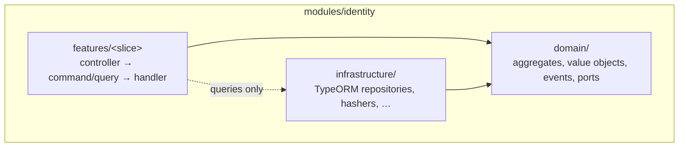
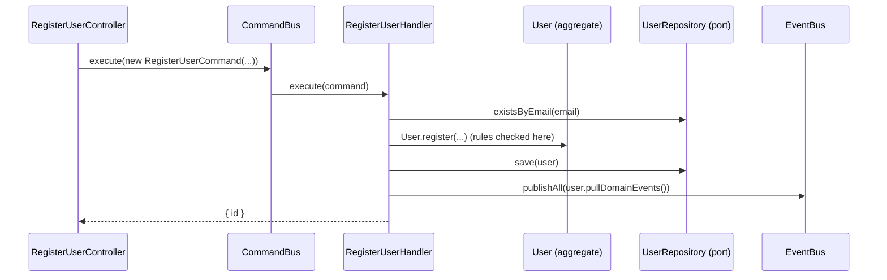
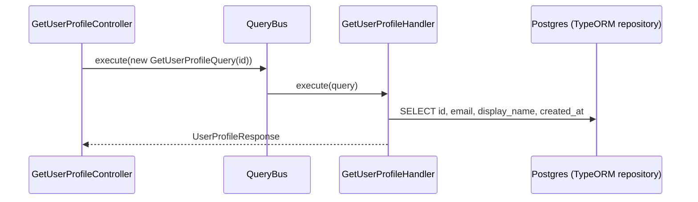

# Backend architecture (apps/api)

The backend is a NestJS application organised with three ideas:

1. **Modules per business area** (bounded contexts): `identity`, `conversations`, `messaging`, …
2. **Clean Architecture inside each module**: business rules in the middle, frameworks and the
   database at the edges.
3. **CQRS + vertical slices**: every use case is one folder containing a command _or_ a query,
   its handler, and its HTTP entry point.

If you only read one example, read `src/modules/identity/`. It is the reference implementation, and
the comments in it explain why each piece exists.

## Folder layout

```
apps/api/src/
├── main.ts                     Starts the HTTP server
├── configure-app.ts            Global pipes, filters, CORS, Swagger (shared with e2e tests)
├── app.module.ts               Lists every module
├── config/environment.ts       Reads + validates environment variables
├── database/
│   ├── typeorm-options.ts      Connection settings + the list of ORM entities
│   ├── data-source.ts          Used by the TypeORM CLI for migrations
│   ├── database.module.ts      Connects the app to Postgres
│   └── migrations/             Every schema change, in order
├── shared/
│   ├── domain/                 Base classes: Entity, AggregateRoot, DomainEvent, DomainError
│   └── infrastructure/         DomainErrorFilter (DomainError → HTTP status)
└── modules/
    └── identity/
        ├── identity.module.ts  The module's table of contents: every slice is registered here
        ├── domain/             Business rules. Plain TypeScript, no framework
        │   ├── user.ts                 Aggregate root
        │   ├── email.ts                Value object
        │   ├── user.repository.ts      Port (abstract class) for storage
        │   ├── password-hasher.ts      Port for hashing
        │   ├── events/                 Domain events (UserRegisteredEvent)
        │   └── errors/                 Domain errors (EmailAlreadyTakenError, …)
        ├── infrastructure/     Technical implementations of the ports
        │   ├── persistence/            TypeORM entity, mapper, repository
        │   └── security/               scrypt password hasher
        ├── features/           One folder per use case (vertical slice)
        │   ├── register-user/          Command slice
        │   └── get-user-profile/       Query slice
        └── testing/            In-memory fakes of the ports for unit tests
```

## The layers and the dependency rule



Arrows mean "may import". In words:

| Layer             | May import                                | Must NOT import                                        |
| ----------------- | ----------------------------------------- | ------------------------------------------------------ |
| `domain/`         | `shared/domain`, other files in `domain/` | `@nestjs/*`, `typeorm`, `features/`, `infrastructure/` |
| `infrastructure/` | `domain/`, NestJS, TypeORM                | `features/`                                            |
| `features/<x>/`   | `domain/`, `infrastructure/`, NestJS      | **any other slice** (`features/<y>/`)                  |

These rules are **enforced by ESLint** (`apps/api/eslint.config.mjs`), so `pnpm lint` fails if you
break them.

Why? The domain holds the rules that make MyChat MyChat ("an email can only be used once", "only
participants can post in a conversation"). Keeping it free of frameworks makes it easy to read, test
without a database, and change the database or framework later without rewriting business logic.

## Ports and adapters

The domain declares what it needs as an **abstract class** (a _port_), e.g. `UserRepository`.
Infrastructure provides the implementation (an _adapter_), e.g. `TypeOrmUserRepository`.
The module file binds them:

```ts
// identity.module.ts
{ provide: UserRepository, useClass: TypeOrmUserRepository },
```

A handler then simply asks for `UserRepository` in its constructor. It never knows TypeORM exists.
Abstract classes are used instead of interfaces because TypeScript interfaces disappear at runtime,
and Nest needs a runtime value as the injection token.

## CQRS: commands vs queries

|                          | Command                                        | Query                                                     |
| ------------------------ | ---------------------------------------------- | --------------------------------------------------------- |
| Purpose                  | Change state ("register user", "send message") | Read state ("get profile", "list messages")               |
| Goes through the domain? | **Yes.** Load aggregate → call method → save   | **No.** Reads the database directly into a response shape |
| Returns                  | Minimal data (usually just an id)              | The data the client asked for                             |
| Example                  | `features/register-user/`                      | `features/get-user-profile/`                              |

Commands use the domain because that's where the rules are. Queries skip it because reading has
no rules to enforce, and a direct `SELECT` is simpler and faster than loading aggregates.

### Command flow



### Query flow



## Vertical slices

Each use case is a folder with the **same files every time**:

| File                                    | Role                                                             |
| --------------------------------------- | ---------------------------------------------------------------- |
| `<name>.command.ts` / `<name>.query.ts` | Plain data object describing the request                         |
| `<name>.handler.ts`                     | Does the work (orchestration only for commands)                  |
| `<name>.controller.ts`                  | HTTP endpoint: DTO → command/query → bus                         |
| `<name>.request.dto.ts`                 | Request body validation + Swagger docs (only if there is a body) |
| `<name>.handler.spec.ts`                | Unit test using the in-memory fakes from `testing/`              |

Slices do not import each other. If two slices need the same logic, it belongs in `domain/`.
If one slice must _react_ to another (e.g. "when a user registers, create their inbox"), use a
**domain event** and an event handler.

Step-by-step: [guides/backend-add-feature-slice.md](../guides/backend-add-feature-slice.md).

## Domain events

Aggregates record events (`this.recordEvent(new UserRegisteredEvent(...))`). After saving, the
command handler publishes them: `this.eventBus.publishAll(user.pullDomainEvents())`.
Any module can subscribe with an `@EventsHandler(UserRegisteredEvent)` class. This is also how
realtime notifications are triggered (see [realtime.md](realtime.md)).

> Events are published _after_ the database commit, in the same process. If the process crashes
> between the two, the event is lost. That's acceptable for now; Phase 7 adds a transactional outbox
> (see [roadmap.md](../roadmap.md)).

## Errors

- **Expected business errors** extend `DomainError` with a stable `code` and a `kind`
  (`validation`, `not-found`, `conflict`, `forbidden`). `DomainErrorFilter` maps `kind` to an HTTP
  status and returns `{ statusCode, code, message }`.
- **Invalid request shape** (missing field, wrong type) is rejected by the global `ValidationPipe`
  with 400, based on the DTO decorators.
- **Anything else** is a bug or an outage and becomes a 500.

## Transactions

A command that saves **one** aggregate needs no explicit transaction: `repository.save()` is atomic.
When a use case must save several aggregates atomically, wrap it with
`dataSource.transaction(async (manager) => …)` inside the repository adapter or a dedicated
unit-of-work port. Add that when the first such use case appears; don't add it speculatively.

## Testing strategy

| Level      | What                                                      | Where                | Command                              |
| ---------- | --------------------------------------------------------- | -------------------- | ------------------------------------ |
| Unit       | Domain objects and command handlers, with in-memory fakes | `src/**/*.spec.ts`   | `pnpm --filter @mychat/api test`     |
| End-to-end | Real HTTP + real Postgres, whole app                      | `test/*.e2e-spec.ts` | `pnpm --filter @mychat/api test:e2e` |

Query handlers are covered by e2e tests, since their whole job is talking to the database.

## Runtime notes

- NestJS 12 packages are ES modules. The app itself compiles to CommonJS and loads them with
  Node's `require(esm)`, which is why **Node.js 24** is required and Jest runs with
  `--experimental-vm-modules` (same setup as the official Nest 12 starter).
- TypeScript is pinned to `~6.0` because that is what the Nest CLI, ts-jest and typescript-eslint
  currently support.
