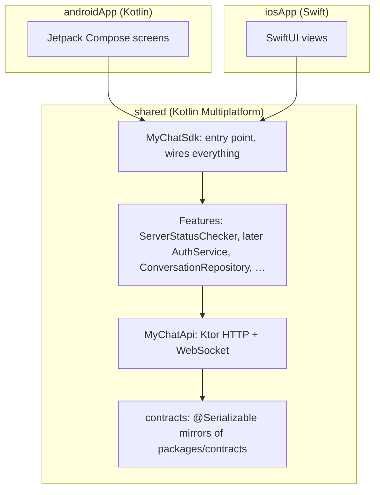

# Mobile architecture (mobile/)

Native apps on both platforms, sharing their non-UI code with **Kotlin Multiplatform (KMP)**.



## What is shared, what is native

| Shared (Kotlin, `mobile/shared`)            | Native per platform                                              |
| ------------------------------------------- | ---------------------------------------------------------------- |
| API calls, JSON models, error handling      | Screens, navigation, animations                                  |
| Business logic (validation, state, caching) | Platform look & feel (Material vs. iOS)                          |
| WebSocket connection + reconnect (Phase 5)  | Push notification registration (Phase 6)                         |
| Local cache (SQLDelight, Phase 5)           | Secure token storage (Keychain / Keystore) via `expect`/`actual` |

Rule of thumb: if it's not UI, it goes in `shared`.

## Module layout

```
mobile/
├── gradle/libs.versions.toml     Every dependency version
├── shared/src/
│   ├── commonMain/               Code for all platforms (most code lives here)
│   ├── commonTest/               Tests for common code (run on JVM with :shared:jvmTest)
│   ├── androidMain/              Android `actual`s + Android-only deps (OkHttp engine)
│   ├── iosMain/                  iOS `actual`s + iOS-only deps (Darwin engine)
│   └── jvmMain/                  JVM `actual`s (used for fast tests on any machine)
├── androidApp/                   Compose UI; depends on project(":shared")
└── iosApp/                       SwiftUI; imports the `Shared` framework built by Gradle
```

## Wiring (no DI framework yet)

`MyChatSdk` builds the object graph with plain constructors. Each app creates **one** instance:
Android in `MyChatApplication`, iOS in `iOSApp`. When the graph grows large enough to hurt, we may
introduce Koin, recorded in a new ADR.

## How Swift consumes Kotlin

- Kotlin classes/functions appear in Swift through the `Shared` framework (`import Shared`).
- Top-level functions live in a class named after the file: `platformName()` in `Platform.kt` is
  `PlatformKt.platformName()` in Swift.
- `suspend` functions become Swift `async` functions. Annotate them with
  `@Throws(CancellationException::class)` (or a wider exception) so Swift can `try await` them.
- Sealed classes become class hierarchies: check them with `is` / `as` in a Swift `switch`.
- **Flows** (streams) don't map to Swift automatically. In Phase 5 we'll either expose callback
  wrappers or adopt [SKIE](https://skie.touchlab.co/), decided in an ADR at that time.

More in [guides/kmp-for-beginners.md](../guides/kmp-for-beginners.md).

## Platforms and where they build

| Build                       | Needs                        |
| --------------------------- | ---------------------------- |
| `:shared:jvmTest`           | Any OS with JDK 17+          |
| `:androidApp:assembleDebug` | Android SDK (Android Studio) |
| iOS app / iOS framework     | macOS + Xcode + XcodeGen     |
