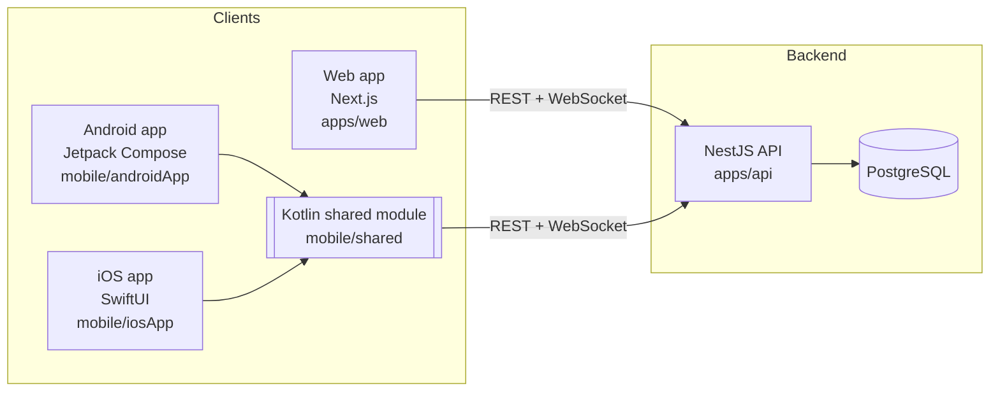

# System overview

MyChat is a chat application with three clients and one backend.



## Repository layout

```
MyChat/
├── apps/
│   ├── api/            NestJS backend (TypeScript)
│   └── web/            Next.js web client (TypeScript)
├── packages/
│   ├── contracts/      Request/response types + WebSocket envelopes shared by api and web
│   └── tsconfig/       Shared TypeScript compiler settings
├── mobile/             Kotlin Multiplatform project (Gradle, separate from pnpm)
│   ├── shared/         Business logic + networking, compiled for Android, iOS and JVM
│   ├── androidApp/     Android UI (Jetpack Compose)
│   └── iosApp/         iOS UI (SwiftUI, Xcode project generated by XcodeGen)
├── docs/               You are here
├── docker-compose.yml  Local PostgreSQL
└── .claude/            Claude Code skills and settings (they point back to docs/)
```

## How the pieces talk

- **REST** (JSON over HTTP) for request/response actions: register, send a message, load history.
- **WebSocket** (JSON envelopes) for things the server pushes: new messages, typing, presence.
  See [realtime.md](realtime.md).
- **Contracts**: the shapes of requests, responses and events are defined once in
  `packages/contracts` (TypeScript). The web app imports them directly; the Kotlin shared module
  mirrors them by hand in `mobile/shared/.../contracts`. [api/contracts.md](../api/contracts.md)
  is the human-readable list.

## Main technology choices

| Area     | Choice                                                      | Why (ADR)                                          |
| -------- | ----------------------------------------------------------- | -------------------------------------------------- |
| Monorepo | pnpm workspaces + Turborepo; Gradle for mobile              | [ADR 0001](../adr/0001-monorepo-pnpm-turborepo.md) |
| Backend  | NestJS, Clean Architecture, CQRS, vertical slices           | [ADR 0002](../adr/0002-backend-architecture.md)    |
| Database | PostgreSQL + TypeORM (data-mapper, migrations only)         | [ADR 0003](../adr/0003-postgres-typeorm.md)        |
| Auth     | Email + password (scrypt), JWT access + refresh tokens      | [ADR 0004](../adr/0004-authentication.md)          |
| Realtime | Raw WebSocket (`@nestjs/platform-ws`) with JSON envelopes   | [ADR 0005](../adr/0005-realtime-websocket.md)      |
| Web      | Next.js App Router + TanStack Query + Tailwind              | [ADR 0006](../adr/0006-web-nextjs.md)              |
| Mobile   | Kotlin Multiplatform shared logic, native SwiftUI + Compose | [ADR 0007](../adr/0007-mobile-kmp-native-ui.md)    |
| Runtime  | Node.js 24 LTS                                              | [ADR 0002](../adr/0002-backend-architecture.md)    |
