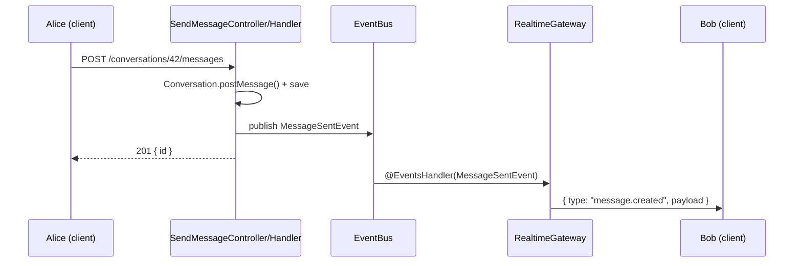

# Realtime messaging (WebSocket)

> Status: **design**. Implemented in Phase 3 (see [roadmap.md](../roadmap.md)). This page is
> the agreed design, so web and mobile can be built against it.

## Why raw WebSocket (not Socket.IO)

Browsers and Ktor (the Kotlin HTTP client used on Android and iOS) both speak the standard
WebSocket protocol natively. Socket.IO needs its own client library on every platform, and there
is no well-maintained one for Kotlin Multiplatform. See [ADR 0005](../adr/0005-realtime-websocket.md).

## Connection

```
ws://<api-host>/ws?token=<access-token>
```

- The access token (JWT) is sent as a query parameter because browsers cannot set headers on a
  WebSocket handshake. The server validates it and closes the socket with code `4401` if invalid.
- One socket per client session. The server keeps a map `userId → sockets` to deliver events.

## Envelope

Every frame, in both directions, is JSON with this shape (`WsEnvelope` in `packages/contracts`):

```json
{ "type": "message.created", "payload": { ... }, "id": "optional-client-id" }
```

## Event catalog

| Direction       | `type`              | Payload                                                          | Phase |
| --------------- | ------------------- | ---------------------------------------------------------------- | ----- |
| server → client | `message.created`   | `{ conversationId, message: { id, senderId, body, createdAt } }` | 3     |
| server → client | `conversation.read` | `{ conversationId, userId, lastReadMessageId }`                  | 3     |
| client → server | `typing.start`      | `{ conversationId }`                                             | 3     |
| server → client | `typing`            | `{ conversationId, userId, isTyping }`                           | 3     |
| server → client | `presence`          | `{ userId, online }`                                             | 3     |
| both            | `ping` / `pong`     | `{}`: keep-alive every 25 s                                      | 3     |

**Sending messages uses REST** (`POST /conversations/:id/messages`), not the socket. That gives
the client a clear success/failure response and reuses the normal command pipeline. The socket is
only for things the server pushes.

## Server flow



The gateway lives in `modules/messaging/realtime/` and is the _only_ code that knows about
sockets. Command handlers never call it directly; they publish domain events.

## Reconnect and missed messages

Clients reconnect with exponential backoff (1 s, 2 s, 4 s … max 30 s). After reconnecting they call
`GET /conversations/:id/messages?after=<lastSeenMessageId>` for each open conversation, so nothing
is lost while offline. The socket is a speed-up, not the source of truth.

## Scaling (Phase 7)

With more than one API instance, a user's sockets may be on another instance. A Redis pub/sub
adapter will forward events between instances. Until then, run a single API instance.
