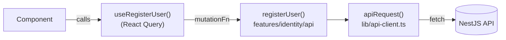

# Web architecture (apps/web)

Next.js with the **App Router**, TypeScript, Tailwind CSS and TanStack Query.

## Folder layout

```
apps/web/src/
├── app/                      Routes only (thin). Each folder = a URL
│   ├── layout.tsx            HTML shell + <Providers>
│   ├── providers.tsx         Client-side providers (React Query)
│   ├── page.tsx              /
│   └── register/page.tsx     /register
├── features/                 One folder per business feature
│   └── identity/
│       ├── api/              Typed functions calling the API (one per endpoint)
│       ├── hooks/            React Query hooks wrapping those functions
│       └── components/       UI of the feature
└── lib/
    └── api-client.ts         The only place that calls fetch()
```

## Rules

1. **Pages are thin.** A `page.tsx` composes components from `features/`. No fetching logic, no
   business logic.
2. **Features don't import other features.** Shared UI goes to `src/components/`, shared helpers to
   `src/lib/`. ESLint enforces this (`apps/web/eslint.config.mjs`).
3. **Types come from `@mychat/contracts`.** Never redeclare an API request/response type in the web
   app. If it's missing, add it to `packages/contracts` first.
4. **Server state lives in React Query** (loading, caching, retries). Use `useState` only for pure
   UI state (is this menu open?).
5. **`'use client'` only where needed.** Components with state, effects or event handlers need it;
   static layout doesn't.

## Data flow



## Configuration

`NEXT_PUBLIC_API_URL` (see `apps/web/.env.example`) is the API base URL. Copy it to `.env.local`.

## Coming next (Phase 4)

Login and token storage, the conversation list, the chat view, and a WebSocket client
(`lib/realtime-client.ts`) with reconnect. See [roadmap.md](../roadmap.md).
